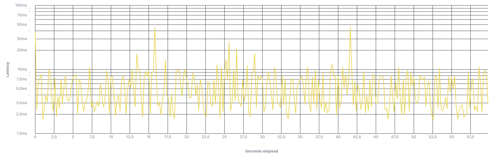

# Avito Backend Internship 2025

## Описание проекта
Реализация тестового задания для Avito Backend Internship 2025 (осень)
[ТЗ](https://github.com/avito-tech/tech-internship/blob/main/Tech%20Internships/Backend/Backend-trainee-assignment-autumn-2025/Backend-trainee-assignment-autumn-2025.md)

[](https://github.com/prr133f/avito-backend-intership-2025/actions/workflows/e2e.yml) 
[](https://github.com/prr133f/avito-backend-intership-2025/actions/workflows/golangci-lint.yml)
[](https://hub.docker.com/r/prr133f/avito)
[](https://hub.docker.com/r/prr133f/avito/tags)
### Стек
- Язык: Golang:v1.24
- База данных: PostgreSQL
- Окружение: Docker
- Библиотеки: pgx/v5, chi/v5
- Миграции: goose
- Тесты: python pytest, vegeta
- Линтеры: golangci-lint

## Запуск
```sh
docker compose up
```

## Запуск через Makefile
Запуск сервиса
```sh
make run
```
Запуск интеграционных тестов
```sh
make e2e
```
Очистка данных  
```sh
make clean
```
Запуск линтеров
```sh
make lint
```

## Результаты нагрузочного тестирования
Тестирование проводилось на ручку /team/get с RPS=5, тестовыми данными создано 20 команд и 200 участников.

